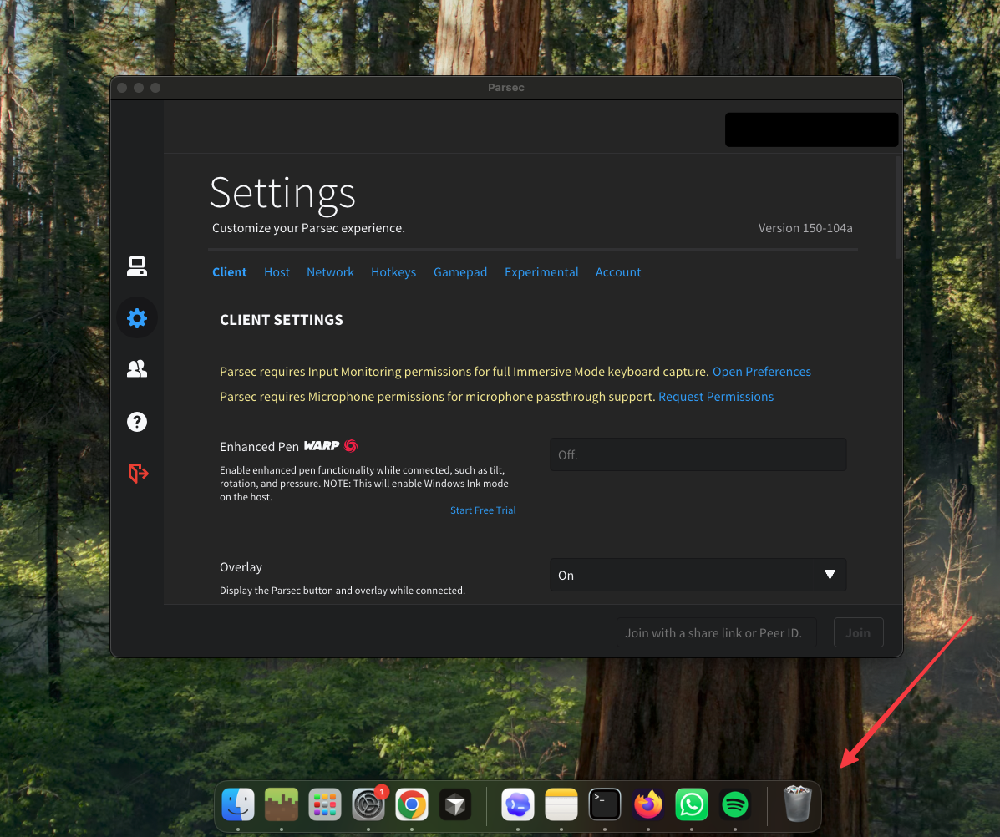

# Hide a macOS App from the Dock

**Hide any macOS app's Dock icon** and run it as a background **agent** — no Dock
icon, no ⌘-Tab (app switcher) entry — even stubborn apps that force themselves
back into the Dock. A small, MIT-licensed command-line tool for macOS.

> Keywords: hide macOS app from Dock · remove Dock icon · macOS background agent ·
> LSUIElement not working · run Mac app without Dock icon · menu-bar-only app ·
> NSApplicationActivationPolicyAccessory · hide app from ⌘-Tab / app switcher.

## Demo



*The app is open and fully usable — its window is focused — yet it has **no icon
in the Dock** (arrow shows where it would normally appear).*

## Why this exists

Setting `LSUIElement` (a.k.a. "Application is agent") or `LSBackgroundOnly` in an
app's `Info.plist` is the documented way to hide a macOS app from the Dock. But
**it often doesn't work**, because many apps override it at runtime by calling
`-[NSApplication setActivationPolicy:]` — frequently through a dynamically
registered selector, so editing the plist or byte-patching the binary won't
reliably stop them.

This tool fixes that by replacing the method itself: it injects a tiny library
that forces **every** `setActivationPolicy:` call to `Accessory`, so the app
runs windowed but Dock-less no matter how it tries to promote itself.

## Features

- ✅ Removes the Dock icon from any macOS app
- ✅ Removes the app from the ⌘-Tab app switcher
- ✅ Windows still open and work normally (Accessory mode, not hidden/prohibited)
- ✅ Works on apps where `LSUIElement` / "Application is agent" is ignored
- ✅ Survives app auto-updates (optional watcher)
- ✅ Universal binary (Apple Silicon + Intel), MIT licensed

## Requirements

- macOS 14 / 15 (tested; likely works on 12+; macOS 26 not yet tested)
- Xcode Command Line Tools (`xcode-select --install`) for `clang`
- Admin rights (`sudo`)

## Quick start

```sh
git clone https://github.com/michaelmitchell-bit/hide-macos-app-dock-icon.git
cd hide-macos-app-dock-icon

# Hide any app from the Dock:
sudo ./install.sh /Applications/SomeApp.app

# Restart the app, then confirm it's now a background agent:
lsappinfo info -app <bundle-id> | grep type=   # expect type="UIElement"
```

Undo it:

```sh
sudo ./uninstall.sh /Applications/SomeApp.app
```

## How it works

1. `src/dockless.m` swizzles `-[NSApplication setActivationPolicy:]` to always
   pass `NSApplicationActivationPolicyAccessory`, and sets that policy itself
   once the app finishes launching (most apps never call it).
2. `install.sh` compiles it into a universal `.dylib`, adds
   `LSEnvironment → DYLD_INSERT_LIBRARIES` to the target app's `Info.plist` so
   the hook loads on every launch, and ad-hoc re-signs the app.

## Keep it working across app updates

Apps that auto-update overwrite their `Info.plist` and revert the change.
Install a watcher (a root LaunchDaemon) that re-applies it automatically:

```sh
sudo ./launchagent/setup-autoreapply.sh /Applications/SomeApp.app
```

## FAQ

**"LSUIElement isn't hiding my app from the Dock — why?"**
The app is almost certainly calling `setActivationPolicy:` at runtime to override
the plist. This tool intercepts that call. See [Why this exists](#why-this-exists).

**"Will the app's windows still open?"**
Yes. It uses `Accessory` policy, which keeps windows working — it only removes
the Dock icon and app-switcher entry. It does not use `Prohibited`, which would
suppress all UI.

**"Does this need to disable SIP?"**
No. It ad-hoc re-signs the target app (which disables that app's hardened runtime
so `DYLD_INSERT_LIBRARIES` is honored). System Integrity Protection stays on.

## Which apps work?

Hiding the Dock icon works on any regular AppKit app (native or Electron).
What varies is whether the app **still works after re-signing**:

| App uses | Result |
|---|---|
| Nothing special | ✅ Works |
| `keychain-access-groups` / app groups | ⚠️ Saved login lost — may need to sign in again or reinstall |
| App Sandbox | ⚠️ May fail to launch or load the hook |

`install.sh` checks for these and asks before changing anything.
Known to lose login: ChatGPT (see [#1](https://github.com/michaelmitchell-bit/hide-macos-app-dock-icon/issues/1)).

## Caveats

- Re-signing changes the app's code identity, so macOS may ask you to re-grant
  Privacy permissions (Screen Recording, Accessibility, etc.) once afterward.
- This replaces the app's Developer ID signature with an ad-hoc one. Only apply
  it to apps you trust, on machines you control.

## Scope

This only changes an app's **activation policy** (Dock / ⌘-Tab visibility). It
does not touch, hide, or suppress any macOS privacy or security indicators.

## License

MIT — see [LICENSE](LICENSE).
